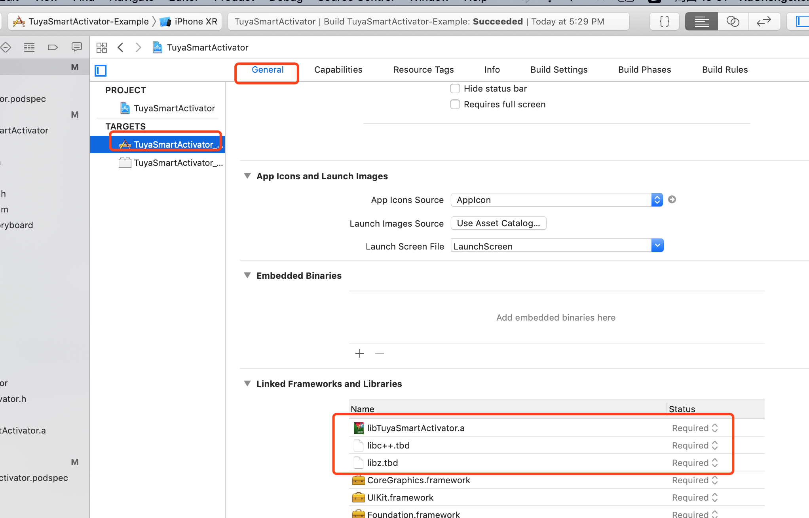

# 涂鸦智能配网 iOS SDK

[中文版](README-zh.md) | [English](README.md)

---

## 功能概述

涂鸦智能配网 SDK 提供了AP，EZ 模式和 Zigbee 网关配网的功能，开始配网和停止配网要结合使用。主要是配合云云对接使用。

## 快速集成 (推荐)

### 使用Cocoapods集成

在`Podfile`文件中添加以下内容：

```ruby
platform :ios, '8.0'

target 'your_target_name' do

   pod "TuyaSmartActivator"

end
```

然后在项目根目录下执行`pod update`命令，集成第三方库。

CocoaPods的使用请参考：[CocoaPods Guides](https://guides.cocoapods.org/)


## 手动集成 (不推荐)

涂鸦智能iOS SDK依赖的第三方库有:

- CocoaAsyncSocket

依赖的系统链接库有:

- libc++
- libz


##### 使用CocoaPods添加第三方库依赖:

在项目根目录`Podfile`文件中添加以下内容,然后保存退出.

```ruby
platform :ios, '8.0'
	
target 'Your_App_Name' do
	pod "CocoaAsyncSocket"
end
```

在项目根目录下执行`pod install`命令,来集成第三方库.

##### 添加系统库依赖:

在项目的`Target -> Build Phases -> Link Binary With Libraries`添加`libc++`, `libz`系统链接库:





## 涂鸦全量 SDK 兼容问题（没有引入全量SDK的忽略）

如果接入了 IPC SDK，会依赖到涂鸦全量SDK，pod 集成需要使用特定的分支：

```ruby
platform :ios, '8.0'

target 'your_target_name' do

   pod 'TuyaSmartActivator', :git => 'https://github.com/TuyaInc/tuyasmart_ios_activator_sdk.git', :branch => 'develop_compatible'

end
```


## 设备配网

涂鸦硬件模块支持三种配网模式：快连模式（TLink，简称EZ模式）、热点模式（AP模式）、Zigbee 网关配网。快连模式操作较为简便，建议在配网失败后，再使用热点模式作为备选方案。Zigbee 网关配网需要网关和路由器在一个局域网内进行配网。

##### 获取token

通过云云对接获取token

##### EZ 模式配网

```objective-c
// start config wifi EZ mode
NSString *ssid = @"";
NSString *password = @"";
NSString *token = @"";
[[TuyaSmartActivator sharedInstance] startConfigWiFiWithMode:TYActivatorModeEZ ssid:ssid password:password token:token];
```

##### 停止配网

开始配网操作后，APP会持续广播配网信息（直到配网成功，或是超时）。如果需要中途取消操作或配网完成，需要调用`[TuyaSmartActivator stopConfigWiFi]`方法。

```
- (void)stopConfigWifi {
    [[TuyaSmartActivator sharedInstance] stopConfigWiFi];
}
```

##### AP 模式配网

```objective-c
// start config wifi AP mode
- (void)startConfig {
  	NSString *ssid = @"";
		NSString *password = @"";
		NSString *token = @"";
		[[TuyaSmartActivator sharedInstance] startConfigWiFiWithMode:TYActivatorModeAP ssid:ssid password:password token:token];
}

// stop config
- (void)stopConfigWifi {
    [[TuyaSmartActivator sharedInstance] stopConfigWiFi];
}
```

##### Zigbee 网关配网 

```objective-c
// start config Zigbee Gateway
- (void)startConfig {
  	NSString *token = @"";
		[[TuyaSmartActivator sharedInstance] startConfigWiredDeviceWithToken:token];
}

// stop config
- (void)stopConfigWifi {
    [[TuyaSmartActivator sharedInstance] stopConfigWiFi];
}
```

